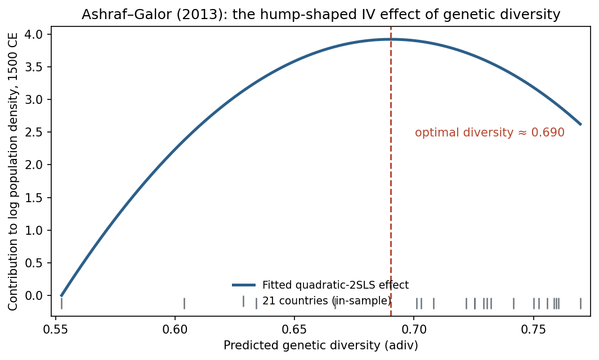

*Ashraf, Quamrul, Galor, Oded (2013) · American Economic Review*

::: {.summary-lead}
Is there a 'sweet spot' of population diversity for long-run prosperity, with too little or too much both holding a country back? The original finds exactly such a hump-shaped pattern and RECAST reproduces it precisely; the machine-learning version can only fit a straight line, so it is reported as a limited cross-check rather than the effect itself.

[**RECAST verdict** — replication **PASS** (PARTIAL); passed two-referee AI review.]{.verdict}
:::

::: {.glance}

FieldGrowth & development

IdentificationIV

Causal-ML methodPLIV (IV)

ReplicationPASS · PARTIAL

:::

## The original paper & its claim

What the paper estimates, the identification strategy RECAST inherits unchanged, and the exact estimand carried into the extension.



## Step 1 · Replicate the published result

Before any machine learning, RECAST reproduces the paper's headline coefficient(s) at the original standard-error convention. **A failed replication halts the pipeline — no extension runs on a result we could not reproduce.**

**Regime:** deterministic · **Gate:** PASS · **Overall tier:** PARTIAL

| Coefficient | Published | Replicated | n | Tier |
|---|---|---|---|---|
| Table 2 col 5 | 285.19 (88.064 se) | 285.1899 (88.063) | 21 | PARTIAL |
| Table 2 col 5 | -206.576 (66.852 se) | -206.5759 (66.852) | 21 | SUCCESS |

[n=21 generated-instrument 2SLS; exact match depends on the first-stage fit reconstruction]{.text-muted-sm}

## Step 2 · Extend with causal ML

RECAST then swaps the parametric first stage for cross-fitted machine learning (**PLIV (IV)**), keeping the paper's *inherited* conditioning set — no data-driven control selection.

The displayed learners are Forest and Lasso — both the linearized PLIV, reported as exploratory (not comparable to the quadratic hump). Full numbers are in the results table below.

## Results — original vs. RECAST, side by side

Every estimate together: the original published number, our replication/extension, and the published benchmark where one exists. The estimator never saw the benchmark — it is compared only after the results were frozen.

**IV replication (quadratic 2SLS)**

| Estimator | Original | Ours | Benchmark | Verdict |
|---|---|---|---|---|
| adiv | 285.19 (SE 88.064) | 285.19 (SE 88.063) | n/a (no revisit paper; compare to original) | PARTIAL |
| adiv_sqr | -206.576 (SE 66.852) | -206.576 (SE 66.852) | n/a (no revisit paper; compare to original) | SUCCESS |

**IV replication**

| Estimator | Original | Ours | Benchmark | Verdict |
|---|---|---|---|---|
| turning point (optimal diversity) | 0.69 | 0.69 | n/a | exact |

**DML extension (LINEARIZED PLIV)**

| Estimator | Original | Ours | Benchmark | Verdict |
|---|---|---|---|---|
| PLIV-Forest | NOT COMPARABLE (hump, not a linear slope) | 7.387 (se 6.188, p=0.233) | none | functional-form-limited (linear PLIV cannot represent the hump) |
| PLIV-Lasso | NOT COMPARABLE (hump, not a linear slope) | 9.175 (se 4.394, p=0.037) | none | functional-form-limited (linear PLIV cannot represent the hump) |

*Verdict counts:* PARTIAL 1, SUCCESS 1, exact 1, functional-form-limited (linear PLIV cannot represent the hump) 2.

::: {.callout-warning}
## Functional-form limitation
original treatment enters NONLINEARLY (functional_form=quadratic); single-treatment linear PLIV cannot represent it. The DML extension is a LINEARIZED exploratory IV slope only — it does NOT recover the original curvature/turning point. Reproduce the nonlinear structure in the replication stage; treat the PLIV number as a functional-form-limited robustness check, not a replacement estimand.
:::

::: {.callout-warning}
## Note
No revisit-paper benchmark. Replication compares to the original published quadratic 2SLS (Table 2 col 5). The DML extension is a linearized exploratory IV slope and is NOT comparable to the hump coefficients.
:::

## Heterogeneity — does the effect vary?

Pre-declared subgroup effects via the standard DoubleML `gate()`/`cate()` (or group-time ATTs for DiD). Exploratory unless a benchmark exists; moderators are fixed in advance (no moderator shopping).

_No revisit-paper benchmark for Ashraf-Galor; the comparison is to the original published quadratic 2SLS. Heterogeneity not in scope._

## The bottom line — what causal ML added

The replication is essentially perfect: the hump-shaped 2SLS coefficients reproduce and the implied optimal diversity (0.690) matches the published value exactly, even with a generated instrument and only 21 countries. The extension is where honesty matters: the estimand router sends IV to a linear PLIV, but a single linear slope cannot represent a hump — so RECAST runs the PLIV, labels it a *linearized exploratory* quantity that is not comparable to the quadratic coefficients, and declines to present it as 'the effect of diversity.' The pipeline recognizing the boundary of its own tool is the point.

## AI peer review

The extension was reviewed over **1 round** by two isolated referees (general + DML-technical) with a synthesis quality-control step. The reports are embedded verbatim.

::: {.panel-tabset}

## Round 1 · General



## Round 1 · Synthesis



## Final report



:::

## Reproduce it

- Note: executed via a bespoke `run_ag.py` script (the generated-instrument IV needed per-paper code), so there is no pipeline notebook for this paper; it also went through a single referee round.
- Full result artifacts (gap table, frozen estimates, referee reports) live in the project's `data/results/` and `paper/review_history/`.
