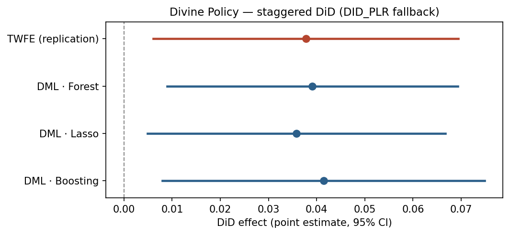

## Summary

**Citation:** Bentzen, J. S., Pizzigolotto, A., Sperling, L. L. (2025). *Divine Policy: The Impact of Religion in Government*. *American Economic Journal: Applied Economics*. [doi:10.1257/app.20240018](https://doi.org/10.1257/app.20240018)

A staggered binary DiD on the paper's own outcome — the count of faith-based nonprofits. DoubleMLDIDMulti (Callaway–Sant'Anna) is infeasible on a 50-state panel, so the pipeline gracefully falls back to the DML two-way-FE estimator (loudly flagged). The effect is positive and significant — TWFE +0.038 (t=2.3); DML +0.036–0.041, significant across all three learners — directionally consistent with the paper's reported increase (+2,258 faith-based organizations).

::: {.glance}

Method pathDID → DID_PLR

Replicationstochastic

Review verdictExtension demo

IdentificationDID

:::

## Estimand & identification



## Replication

**Regime:** stochastic · **Gate:** PASS · **Overall tier:** PARTIAL

No deterministic published target is available, so replication is a documented *partial*. Our estimate: **0.0377** (SE 0.0162), n = 1050.

[The manuscript IS in the package (not paywalled). PARTIAL because (a) the paper's headline religiosity/attitudes outcomes use restricted GSS microdata not shipped here, and (b) the original stacked event-study build is in Stata (unavailable), so the panel is reconstructed in Python. The faith-based-nonprofit mechanism is reproduced as a simplified static DiD on the log count of faith-based nonprofits and compared DIRECTIONALLY (sign + significance) to the paper's reported positive NPO effect (+2,258 orgs, manuscript p.4).]{.text-muted-sm}

## The gap table

Original result, our replication/extension, the published benchmark (where one exists), and the verdict. The estimator never saw the benchmark — it is compared only after the results were frozen.

**Staggered DiD (log faith-based-NPO count ~ FBI adoption)**

| Estimator | Original | Ours | Benchmark | Verdict |
|---|---|---|---|---|
| TWFE DiD (replication) | paper: significant + increase in faith-based nonprofits (+2,258 orgs back-of-envelope; stacked event-study DiD; manuscript p.4) | 0.0377 (se 0.0162, t 2.33) | no independent revisit (2025 paper) | consistent |

**DML extension (DID -> DID_PLR fallback)**

| Estimator | Original | Ours | Benchmark | Verdict |
|---|---|---|---|---|
| DML - Forest | - | 0.0391 (se 0.0154, p 0.011) | - | consistent |
| DML - Lasso | - | 0.0358 (se 0.0158, p 0.023) | - | consistent |
| DML - Boosting | - | 0.0414 (se 0.0171, p 0.015) | - | consistent |

*Verdict counts:* consistent 4.

::: {.callout-warning}
## Note
The manuscript IS in the package (not paywalled). The paper's HEADLINE outcomes (church attendance, religiosity, conservative-religious attitudes) rely on GSS microdata (GSS7218_R3.dta) that is NOT shipped — that is the real restriction. The faith-based-NONPROFIT mechanism IS reproducible from the included NCCS data: the paper reports a significant positive increase (+2,258 orgs, manuscript p.4) via a STACKED event-study; this recast runs a simplified static DiD on the log count of faith-based nonprofits, reconstructed in Python (no Stata for the stacked build), so the comparison is DIRECTIONAL (sign + significance), not a numeric match. Callaway & Sant'Anna (DoubleMLDIDMulti) was infeasible at this sample size (small cross-section / too few never-treated units / empty (g,t) cells); reported estimate is the DML two-way-FE DiD on a treated x post indicator. This is subject to the TWFE-under-staggered-heterogeneity caveat that CS2021 addresses -- interpret as an approximate average ATT, not the CS group-time estimate.
:::

## Causal-ML extension

Per-learner numbers are in the gap table above. 
All learners are the DML difference-in-differences estimator described above.

## What causal ML added

The design is the staggered adoption of state faith-based initiatives, so the router sends it to DoubleMLDIDMulti. But with only 50 states (6 never-treated, several single-state cohorts) the Callaway–Sant'Anna ML estimator hits empty per-(g,t) nuisance cells and cannot be fit — so the pipeline falls back to the DML two-way-FE estimator on a treated × post indicator and labels it loudly, because TWFE under staggered heterogeneity is exactly what Callaway–Sant'Anna exists to correct. The outcome is the log count of faith-based nonprofits, using the paper's own definition (categorized religious by the NCCS or carrying religious terms in the name); the effect is positive and significant (~+3.8%), directionally consistent with the paper's stacked-event-study finding (a significant rise of about 2,258 faith-based organizations). The comparison is directional, not a numeric match: the paper uses a stacked event-study and we run a simplified static DiD on a Python-reconstructed panel (no Stata). The paper's headline religiosity/attitudes outcomes use GSS microdata that is restricted and not shipped in the package, so they are out of scope here.

## AI peer review

This run is a **replication + causal-ML extension demonstration** of the difference-in-differences pathway; it has not yet been put through the two-referee AI review (unlike the studies above).

## Downloads & reproducibility

- Data: state×year panel reconstructed in Python from the openICPSR raw files (Sager faith-based-law timing + the 14.4M-row NCCS nonprofit panel) by the project's `build_project.py`; the manuscript IS in the package, but the headline GSS attitudes outcome uses restricted microdata that is not.
- Full result artifacts (gap table, frozen estimates, referee reports) live in the project's `data/results/` and `paper/review_history/`.
