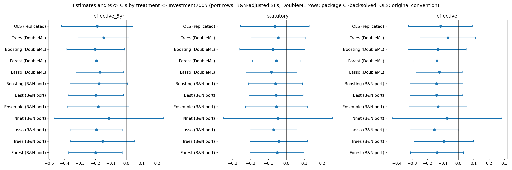

*Djankov, S., Ganser, T., McLiesh, C., Ramalho, R., Shleifer, A. (2010) · American Economic Journal: Macroeconomics*

::: {.summary-lead}
The all-12-controls OLS replicates 3/3 exactly and the DML port is 17/21 consistent with the benchmark; a control-discipline screen flags 6 of 12 controls and discloses the resulting sensitivity (−0.200 → −0.230).

[**Bottom line** — replication **PASS** (SUCCESS); passed two-referee AI review.]{.verdict}
:::

::: {.glance}

FieldPublic Finance

IdentificationOLS

Causal-ML methodPLR

ReplicationPASS · SUCCESS

:::

## The original paper & its claim

What the paper estimates, the identification strategy RECAST inherits unchanged, and the exact estimand carried into the extension.



## Step 1 · Replicate the published result

Before any machine learning, RECAST reproduces the paper's headline coefficient(s) at the original standard-error convention. **A failed replication halts the pipeline — no extension runs on a result we could not reproduce.**

**Regime:** deterministic · **Gate:** PASS · **Overall tier:** SUCCESS

| Coefficient | Published | Replicated | n | Tier |
|---|---|---|---|---|
| B&N (2024) Table 1, Panel A, col (8) OLS, Line 1 (= Djankov Table 5D, statutory) | -0.064 (0.098 se) | -0.0645 (0.098) | 61 | SUCCESS |
| B&N (2024) Table 1, Panel A, col (8) OLS, Line 2 (= Djankov Table 5D, first-year effective) | -0.117 (0.106 se) | -0.1165 (0.106) | 61 | SUCCESS |
| B&N (2024) Table 1, Panel A, col (8) OLS, Line 3 (= Djankov Table 5D, five-year effective) | -0.189 (0.118 se) | -0.1887 (0.118) | 61 | SUCCESS |

## Step 2 · Extend with causal ML

RECAST then swaps the parametric first stage for cross-fitted machine learning (**PLR**), keeping the paper's *inherited* conditioning set — no data-driven control selection.

The preferred display learner is *Best* (lowest nuisance RMSE); full per-learner numbers are in the results table below.

## Results — original vs. RECAST, side by side

Every estimate together: the original published number, our replication/extension, and the published benchmark where one exists. The estimator never saw the benchmark — it is compared only after the results were frozen.

**Statutory rate**

| Estimator | Original | Ours | Benchmark | Δ | Verdict |
|---|---|---|---|---|---|
| OLS (all-controls) | -0.064 (0.098) | -0.0645 (0.098) | -0.064 (0.098) | -0.0005 | exact |
| DML-Lasso | - | -0.071 (0.067) | -0.081 (0.083) | +0.0097 | consistent |
| DML-Trees | - | -0.043 (0.082) | -0.056 (0.075) | +0.0133 | consistent |
| DML-Boosting | - | -0.061 (0.077) | -0.065 (0.076) | +0.0044 | consistent |
| DML-Forest | - | -0.052 (0.077) | -0.077 (0.084) | +0.0252 | consistent |
| DML-Nnet | - | -0.047 (0.156) | -0.056 (0.103) | +0.0089 | consistent |
| DML-Ensemble | - | -0.055 (0.088) | -0.074 (0.09) | +0.0185 | consistent |
| DML-Best | - | -0.058 (0.077) | -0.068 (0.089) | +0.0101 | consistent |

**First-year effective**

| Estimator | Original | Ours | Benchmark | Δ | Verdict |
|---|---|---|---|---|---|
| OLS (all-controls) | -0.117 (0.106) | -0.1165 (0.106) | -0.117 (0.106) | +0.0005 | exact |
| DML-Lasso | - | -0.157 (0.080) | -0.122 (0.092) | -0.0345 | consistent |
| DML-Trees | - | -0.095 (0.099) | -0.133 (0.089) | +0.0380 | consistent |
| DML-Boosting | - | -0.141 (0.088) | -0.156 (0.087) | +0.0145 | consistent |
| DML-Forest | - | -0.139 (0.088) | -0.142 (0.093) | +0.0031 | consistent |
| DML-Nnet | - | -0.074 (0.181) | -0.137 (0.101) | +0.0634 | consistent |
| DML-Ensemble | - | -0.132 (0.096) | -0.134 (0.091) | +0.0016 | consistent |
| DML-Best | - | -0.142 (0.087) | -0.138 (0.091) | -0.0044 | consistent |

**Five-year effective**

| Estimator | Original | Ours | Benchmark | Δ | Verdict |
|---|---|---|---|---|---|
| OLS (all-controls) | -0.189 (0.118) | -0.1887 (0.118) | -0.189 (0.118) | +0.0003 | exact |
| DML-Lasso | - | -0.193 (0.085) | -0.178 (0.096) | -0.0155 | tension |
| DML-Trees | - | -0.155 (0.107) | -0.179 (0.095) | +0.0243 | consistent |
| DML-Boosting | - | -0.178 (0.095) | -0.199 (0.091) | +0.0208 | tension |
| DML-Forest | - | -0.200 (0.089) | -0.204 (0.094) | +0.0040 | consistent |
| DML-Nnet | - | -0.113 (0.181) | -0.218 (0.101) | +0.1050 | tension |
| DML-Ensemble | - | -0.183 (0.102) | -0.195 (0.099) | +0.0122 | tension |
| DML-Best | - | -0.198 (0.091) | -0.203 (0.101) | +0.0051 | consistent |

**CONTROL DISCIPLINE**

| Estimator | Original | Ours | Benchmark | Δ | Verdict |
|---|---|---|---|---|---|
| 5yr-Forest excl 6 suspect controls | - | -0.230 (B&N-adj SE 0.089; n_rep=50) | headline 5yr-Forest -0.200 (full set) | -0.0299 | sensitivity (inherited set is headline; this is the documented robustness variant) |

*Verdict counts:* exact 3, consistent 17, tension 4, sensitivity (inherited set is headline; this is the documented robustness variant) 1.

::: {.callout-warning}
## Note
B&N Table 1 Panel A (Investment) benchmark. OLS rows deterministic (all-controls kitchen sink); DML rows = faithful B&N port vs B&N published, two-layer materiality. Suspect-controls sensitivity reported (6/12 flagged); inherited full set remains the headline per control-discipline rule.
:::

::: {.callout-warning}
## On the “tension” cells
The 4 "tension" cells are SIGNIFICANCE-CATEGORY FLIPS, not coefficient disagreements: the point gaps to B&N are all < 1 benchmark SE (0.012-0.035), but our slightly smaller B&N-adjusted SEs push the estimate across (or B&N across) the 5% threshold (e.g. five-year Lasso ours -0.193/0.085 significant vs B&N -0.178/0.096 not). Per stochastic_agreement, a qualitative-conclusion flip is labeled tension even at a small gap (the qual_agree layer). All same sign; none is a material coefficient divergence.
:::

## Heterogeneity — does the effect vary?

Pre-declared subgroup effects via the standard DoubleML `gate()`/`cate()` (or group-time ATTs for DiD). Exploratory unless a benchmark exists; moderators are fixed in advance (no moderator shopping).

_no declared moderators — heterogeneity not computed; the estimand of interest is the (benchmarked) average effect. PLR gate()/cate() is available but no moderators were pre-declared, so none were estimated (no moderator shopping)._

## The bottom line — what causal ML added

This run targets the over-conditioning failure mode directly. The 'kitchen-sink' OLS reproduces exactly and the DML port strengthens the tax effect, matching the benchmark on 17 of 21 cells (the four 'tension' cells are significance-category flips on near-identical coefficients, not disagreements). The contribution is control discipline: a screen flags 6 of 12 inherited controls as plausible bad controls (a tax-payments mediator and a fiscal-bundle of sibling tax variables). Per the rule, the inherited full set stays the headline for comparability, and a documented sensitivity excluding the suspects is reported — the five-year estimate moves −0.200 → −0.230, the attenuation you would expect if those controls sit on the causal path. No claim is made that either number is the 'true' effect.

## AI peer review

The extension was reviewed over **1 round** by two isolated referees (general + DML-technical) with a synthesis quality-control step. The reports are embedded verbatim.

::: {.panel-tabset}

## Round 1 · General



## Round 1 · DML-technical



## Round 1 · Synthesis



## Round 1 · Revision log



## Final report



:::

## Reproduce it

- Full result artifacts (gap table, frozen estimates, referee reports) live in the project's `data/results/` and `paper/review_history/`.
