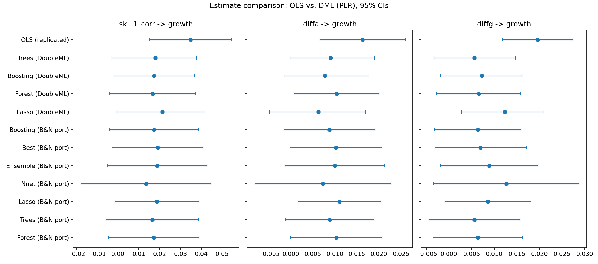

## Summary

**Citation:** Nunn, N., Trefler, D. (2010). *The Structure of Tariffs and Long-Term Growth*. *American Economic Journal: Macroeconomics*.

DML roughly halves the OLS skill-bias/growth effect and drops 5% significance for most learners; the automated pipeline reproduced the hand-built analysis bit-for-bit and matched the benchmark 21/21.

::: {.glance}

Method pathPLR

Replicationdeterministic

Review verdictReady

IdentificationOLS

:::

## Estimand & identification



## Replication

**Regime:** deterministic · **Gate:** PASS · **Overall tier:** SUCCESS

| Coefficient | Published | Replicated | n | Tier |
|---|---|---|---|---|
| Table 4 col 1 | 0.035 (3.5 t) | 0.0348 (3.498) | 63 | SUCCESS |
| Table 4 col 2 | 0.016 (3.29 t) | 0.0163 (3.286) | 63 | SUCCESS |
| Table 4 col 4 | 0.02 (4.91 t) | 0.0196 (4.908) | 63 | SUCCESS |

## The gap table

Original result, our replication/extension, the published benchmark (where one exists), and the verdict. The estimator never saw the benchmark — it is compared only after the results were frozen.

**Skill tariff correlation**

| Estimator | Original | Ours | Benchmark | Δ | Verdict |
|---|---|---|---|---|---|
| OLS (original spec) | 0.035 (3.5 t) | 0.0348 (0.0100) | 0.035 (0.01) | -0.0002 | exact |
| DML - Lasso | - | 0.0187 (0.0103) | 0.019 (0.01) | -0.0003 | consistent |
| DML - Trees | - | 0.0165 (0.0114) | 0.016 (0.012) | +0.0005 | consistent |
| DML - Boosting | - | 0.0173 (0.0109) | 0.016 (0.011) | +0.0013 | consistent |
| DML - Forest | - | 0.0172 (0.0111) | 0.016 (0.011) | +0.0012 | consistent |
| DML - Nnet | - | 0.0134 (0.0159) | 0.013 (0.015) | +0.0004 | consistent |
| DML - Ensemble | - | 0.0188 (0.0122) | 0.019 (0.012) | -0.0001 | consistent |
| DML - Best | - | 0.0191 (0.0111) | 0.016 (0.011) | +0.0031 | consistent |

**Tariff differential (low cut-off)**

| Estimator | Original | Ours | Benchmark | Δ | Verdict |
|---|---|---|---|---|---|
| OLS (original spec) | 0.016 (3.29 t) | 0.0163 (0.0049) | 0.016 (0.006) | +0.0003 | exact |
| DML - Lasso | - | 0.0110 (0.0048) | 0.01 (0.005) | +0.0010 | consistent |
| DML - Trees | - | 0.0088 (0.0052) | 0.008 (0.005) | +0.0008 | consistent |
| DML - Boosting | - | 0.0088 (0.0053) | 0.009 (0.005) | -0.0002 | consistent |
| DML - Forest | - | 0.0103 (0.0053) | 0.008 (0.006) | +0.0023 | consistent |
| DML - Nnet | - | 0.0073 (0.0079) | 0.006 (0.008) | +0.0013 | consistent |
| DML - Ensemble | - | 0.0100 (0.0058) | 0.008 (0.006) | +0.0020 | consistent |
| DML - Best | - | 0.0103 (0.0053) | 0.008 (0.006) | +0.0023 | consistent |

**Tariff differential (high cut-off)**

| Estimator | Original | Ours | Benchmark | Δ | Verdict |
|---|---|---|---|---|---|
| OLS (original spec) | 0.02 (4.91 t) | 0.0196 (0.0040) | 0.02 (0.004) | -0.0004 | exact |
| DML - Lasso | - | 0.0086 (0.0049) | 0.009 (0.005) | -0.0004 | consistent |
| DML - Trees | - | 0.0056 (0.0051) | 0.006 (0.005) | -0.0004 | consistent |
| DML - Boosting | - | 0.0064 (0.0049) | 0.007 (0.005) | -0.0006 | consistent |
| DML - Forest | - | 0.0064 (0.0050) | 0.008 (0.005) | -0.0016 | consistent |
| DML - Nnet | - | 0.0127 (0.0082) | 0.013 (0.008) | -0.0003 | consistent |
| DML - Ensemble | - | 0.0089 (0.0055) | 0.009 (0.005) | -0.0001 | consistent |
| DML - Best | - | 0.0070 (0.0052) | 0.008 (0.005) | -0.0010 | consistent |

**Heterogeneity**

| Estimator | Original | Ours | Benchmark | Δ | Verdict |
|---|---|---|---|---|---|
| gate_init | - | see hte_results.json | none (B&N do not run GATES/generic ML on tariffs (binary-treatment requirement, their ...) |  | exploratory |
| cate_init | - | see hte_results.json | none (B&N do not run GATES/generic ML on tariffs (binary-treatment requirement, their ...) |  | exploratory |
| gate_human_cap | - | see hte_results.json | none (B&N do not run GATES/generic ML on tariffs (binary-treatment requirement, their ...) |  | exploratory |
| cate_human_cap | - | see hte_results.json | none (B&N do not run GATES/generic ML on tariffs (binary-treatment requirement, their ...) |  | exploratory |

*Verdict counts:* exact 3, consistent 21, exploratory 4.

[extension stage never saw benchmark_results.json; gap table computed by the orchestrator after dml_results.json was frozen (frozen `dml_results.json` sha256 `dcd883cff19d9e4e`)]{.text-muted-sm}

## Causal-ML extension

Per-learner numbers are in the gap table above. 
The preferred display learner is *Best* (the lowest-nuisance-RMSE composition).

## Heterogeneity (GATE / CATE)

DoubleML `PLR.gate()`/`.cate()` over the pre-declared moderator(s) *init, human_cap* (joint CIs via multiplier bootstrap; `*` = group whose joint CI excludes 0):
- **init** (GATE): init T1 = -0.0178 · init T2 = +0.0477 · init T3 = +0.0068 — groups not statistically distinguishable (joint CIs overlap 0).
  - CATE (spline): ranges -0.0749…+0.0592 across the init support.
- **human_cap** (GATE): human_cap T1 = +0.0026 · human_cap T2 = +0.0285 · human_cap T3 = +0.0210 — groups not statistically distinguishable (joint CIs overlap 0).
  - CATE (spline): ranges -0.0062…+0.0420 across the human_cap support.

[EXPLORATORY: no benchmark exists for these quantities (generic ML requires a binary treatment). BLP-projection of the heterogeneous slope; joint CIs via multiplier bootstrap; n is small — groups are likely statistically indistinguishable and we say so when they are.]{.text-muted-sm}

## What causal ML added

The DML extension is a clean robustness verdict: across all seven learners and all three treatments the positive skill-bias/growth association keeps its sign, but the point estimates roughly halve (e.g. 0.035 → 0.019 for the correlation measure) and most 95% intervals cover zero at n = 63. That matches the Baiardi–Naghi finding and the original authors' own reading that much of the OLS coefficient reflects the endogeneity of tariff policy. The exploratory tercile heterogeneity finds nothing distinguishable at this sample size, and says so. Most importantly for the pipeline itself, this run is the regression test: the automation reproduced the hand-built notebook to zero numerical drift.

## AI peer review

The extension was reviewed over **2 rounds** by two isolated referees (general + DML-technical) with a synthesis quality-control step. The reports are embedded verbatim.

::: {.panel-tabset}

## Round 1 · General



## Round 1 · DML-technical



## Round 1 · Synthesis



## Round 1 · Revision log



## Round 2 · General



## Round 2 · DML-technical



## Final report



:::

## Downloads & reproducibility

- [Hand-built walkthrough notebook (.ipynb)](../../downloads/recast_phase1_nunn_trefler.ipynb) — the analysis this run reproduced bit-for-bit.
- Full result artifacts (gap table, frozen estimates, referee reports) live in the project's `data/results/` and `paper/review_history/`.
