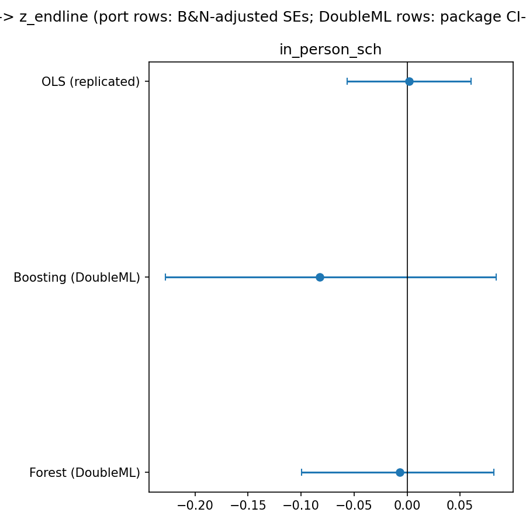
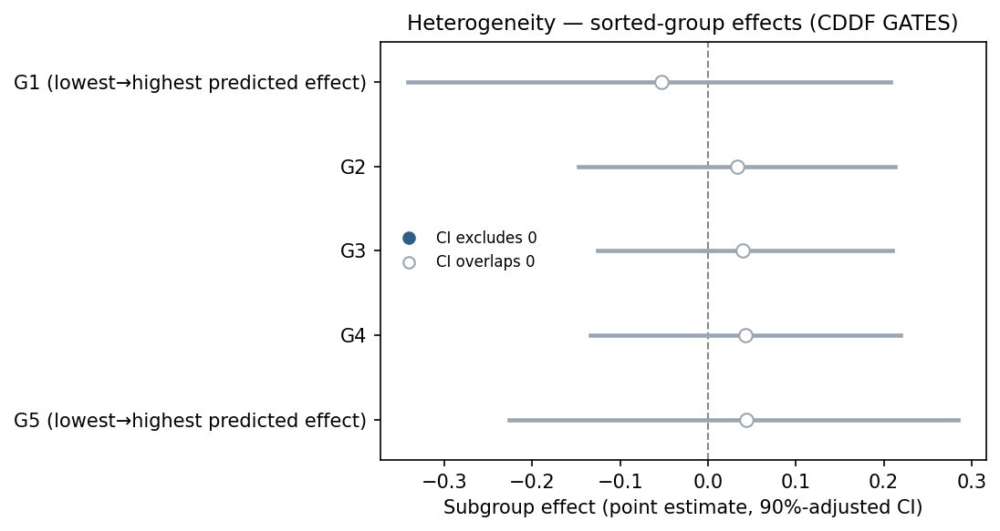

*Loyalka, P., Popova, A., Li, G., Shi, Z. (2019) · American Economic Journal: Applied Economics*

::: {.summary-lead}
Does a teacher-training program raise student test scores? The randomized trial found essentially no average effect — and RECAST reproduces that null — while a machine-learning search for which students gain most turns up only suggestive, not statistically firm, patterns.

[**RECAST verdict** — replication **PASS** (PARTIAL); passed two-referee AI review.]{.verdict}
:::

::: {.glance}

FieldEconomics of education

IdentificationOLS

Causal-ML methodIRM + generic ML

ReplicationPASS · PARTIAL

:::

## The original paper & its claim

What the paper estimates, the identification strategy RECAST inherits unchanged, and the exact estimand carried into the extension.



## Step 1 · Replicate the published result

Before any machine learning, RECAST reproduces the paper's headline coefficient(s) at the original standard-error convention. **A failed replication halts the pipeline — no extension runs on a result we could not reproduce.**

**Regime:** stochastic · **Gate:** PASS · **Overall tier:** PARTIAL

No deterministic published target is available, so replication is a documented *partial*. Our estimate: **0.0018** (SE 0.0298), n = 9676.

[original replication package not on disk; data is B&N's prepared analysis sample; replication regime is stochastic]{.text-muted-sm}

## Step 2 · Extend with causal ML

RECAST then swaps the parametric first stage for cross-fitted machine learning (**IRM + generic ML**), keeping the paper's *inherited* conditioning set — no data-driven control selection.

The displayed BLP learner is the neural-network proxy (the Λ-criterion best, matching the benchmark). Full numbers below.

## Results — original vs. RECAST, side by side

Every estimate together: the original published number, our replication/extension, and the published benchmark where one exists. The estimator never saw the benchmark — it is compared only after the results were frozen.

**ATE**

| Estimator | Original | Ours | Benchmark | Δ | Verdict |
|---|---|---|---|---|---|
| OLS ITT (ours, clustered) | not on disk | 0.0018 (0.0298) | 0.002 CI90 [-0.068, 0.072] | -0.0002 | consistent |

**Generic ML (BLP)**

| Estimator | Original | Ours | Benchmark | Δ | Verdict |
|---|---|---|---|---|---|
| beta1 (NeuralNet) | - | 0.0082 CI90 [-0.119, 0.141] p=0.9094 | 0.002 CI90 [-0.068, 0.072] p=1.0 (= the OLS benchmark row to the printed precision; B&N report BLP beta1 coincident with their ATE) | +0.0062 | consistent |
| beta2 (NeuralNet) | - | 0.1996 CI90 [-0.310, 0.695] p=0.5599 | 0.651 CI90 [0.312, 0.99] p=0.0003 | -0.4514 | **divergent** |

**Generic ML (GATES)**

| Estimator | Original | Ours | Benchmark | Δ | Verdict |
|---|---|---|---|---|---|
| quintile pattern (NeuralNet) | - | gammas -0.053, +0.033, +0.039, +0.043, +0.044; significant groups: 0/5 | qualitative only (S3.14 not on disk): bottom<0 sig10, top>0 sig10, middle null |  | shape-consistent, significance NOT reproduced |

**Generic ML (CLAN)**

| Estimator | Original | Ours | Benchmark | Δ | Verdict |
|---|---|---|---|---|---|
| teacher_college_degree | - | 0.130/0.552 p=0.0000 | 0.039/0.8 p=0.0 | +0.3389 | consistent |
| teacher_training_hours | - | 2.082/1.865 p=0.0000 | 2.447/1.684 p=0.0 | -0.5461 | consistent |
| teacher_ranking | - | 0.644/0.453 p=0.0000 | 0.666/0.405 p=0.0 | -0.0706 | consistent |
| student_age | - | 14.098/13.653 p=0.0000 | 14.18/13.73 p=0.0 | -0.0052 | consistent |
| teacher_experience | - | 16.064/14.377 p=0.0000 | 16.18/13.16 p=0.0 | -1.3326 | consistent |
| student_female | - | 0.460/0.524 p=0.0001 | 0.417/0.555 p=0.0 | +0.0743 | consistent |
| teacher_age | - | 37.375/36.204 p=0.0000 | 37.51/35.01 p=0.0 | -1.3286 | consistent |
| student_baseline_math | - | 0.141/0.112 p=0.0000 | -0.029/0.169 p=0.005 | +0.2268 | **direction-flipped** |
| student_math_anxiety | - | 0.034/-0.111 p=0.0001 | 0.298/-0.219 p=0.0 | -0.3723 | consistent |
| class_size | - | 58.675/62.212 p=0.0000 | 52.87/64.37 p=0.0 | +7.9624 | consistent |

**IRM ATE (extension)**

| Estimator | Original | Ours | Benchmark | Δ | Verdict |
|---|---|---|---|---|---|
| IRM - Forest | - | -0.0068 (0.0452) | B&N report no DML learner table for this RCT; our IRM ATE rows have no per-learner benchmark and are labeled accordingly. |  | no benchmark |
| IRM - Boosting | - | -0.0827 (0.0851) | B&N report no DML learner table for this RCT; our IRM ATE rows have no per-learner benchmark and are labeled accordingly. |  | no benchmark |

*Verdict counts:* consistent 11, divergent 1, shape-consistent, significance NOT reproduced 1, direction-flipped 1, no benchmark 2.

[extension stage never saw benchmark_results.json; gap table computed by the orchestrator after dml_results.json was frozen (frozen `dml_results.json` sha256 `c6d1b7660c2c57be`)]{.text-muted-sm}

## Heterogeneity — does the effect vary?

Pre-declared subgroup effects via the standard DoubleML `gate()`/`cate()` (or group-time ATTs for DiD). Exploratory unless a benchmark exists; moderators are fixed in advance (no moderator shopping).

Benchmarkable **generic-ML (CDDF 2018)** sorted-group analysis (BLP / GATES / CLAN) — the standard RCT heterogeneity.
GATES (groups sorted by predicted effect), best learner *NeuralNet*: G1=-0.053 · G2=+0.033 · G3=+0.039 · G4=+0.043 · G5=+0.044

## The bottom line — what causal ML added

This is the most informative result on the site because it is not clean. The average effect reproduces the known null, and the rank-dependent heterogeneity structure reproduces (which students/teachers sort to the tails: CLAN 9/10 directions, the GATES shape). But the *scale* of the heterogeneity — the headline BLP β₂ — is a third of the benchmark and statistically insignificant. A blocking referee finding (omitted randomization strata) was fixed and the run repeated; restoring the strata moved β₂ only from 0.178 to 0.200, which *eliminated* that explanation rather than closing the gap. RECAST reports this as genuine implementation sensitivity of generic-ML heterogeneity inference — not evidence against the benchmark, and certainly not a success it did not earn.

## AI peer review

The extension was reviewed over **2 rounds** by two isolated referees (general + DML-technical) with a synthesis quality-control step. The reports are embedded verbatim.

::: {.panel-tabset}

## Round 1 · General



## Round 1 · DML-technical



## Round 1 · Synthesis



## Round 1 · Revision log



## Round 2 · General



## Round 2 · DML-technical



## Final report



:::

## Reproduce it

- Full result artifacts (gap table, frozen estimates, referee reports) live in the project's `data/results/` and `paper/review_history/`.
