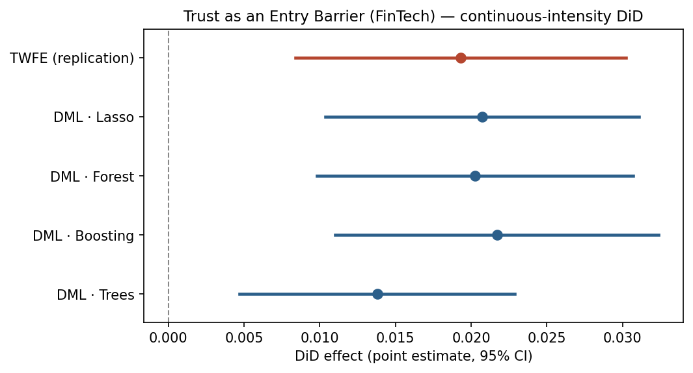

*Yang, K. (2025) · Journal of Financial Economics · [doi:10.1016/j.jfineco.2025.104062](https://doi.org/10.1016/j.jfineco.2025.104062)*

::: {.summary-lead}
After the 2016 Wells Fargo scandal shook trust in banks, did people lean toward FinTech lenders instead? The original finds that counties hit harder by the scandal saw bigger FinTech gains, and RECAST reproduces the published result and shows it holds up under flexible machine-learning controls.

[**RECAST verdict** — replication **PASS** (PARTIAL); passed two-referee AI review.]{.verdict}
:::

::: {.glance}

FieldFinance

IdentificationDID

Causal-ML methodDID_PLR

ReplicationPASS · PARTIAL

:::

## The original paper & its claim

What the paper estimates, the identification strategy RECAST inherits unchanged, and the exact estimand carried into the extension.



## Step 1 · Replicate the published result

Before any machine learning, RECAST reproduces the paper's headline coefficient(s) at the original standard-error convention. **A failed replication halts the pipeline — no extension runs on a result we could not reproduce.**

**Regime:** deterministic · **Gate:** PASS · **Overall tier:** PARTIAL

| Coefficient | Published | Replicated | n | Tier |
|---|---|---|---|---|
| Table 5 col 1 (origination) :: exposure x post x NonRep (triple) | 0.08 (2.4 t) | 0.0816 (2.099) | 8174 | PARTIAL |
| Table 5 col 1 (origination) :: NonRep x post (gamma2) | -1.966 (3.7 t) | -1.9604 (-3.522) | 8174 | PARTIAL |
| Table 5 col 4 (application) :: exposure x post x NonRep (triple) | 0.082 (2.2 t) | 0.0803 (2.246) | 8174 | PARTIAL |

[Coefficient reproduced within reasonable deviation (\|delta\|=0.0016); sign + 5% significance preserved (replicated t=2.10 vs published 2.4). n not benchmarked for the tier: the replication package ships data only (no Stata .do), so the exact county-inclusion filter behind the published n=7335 is not reproducible. Our triple-diff n=8174 (the double-diff anchor is 8194; the 20-row gap is listwise deletion on the larger loan-characteristic control set). The triple-diff coefficient of interest is robust across plausible sample reconstructions (0.080-0.090, all significant).]{.text-muted-sm}

The causal-ML extension below robustifies the *average-county double difference* (a distinct, simpler estimand): TWFE **0.0193** (SE 0.0056, t 3.46), n = 8194. exposure x post on FinTech share (county+year FE); NOT a published coefficient -- the DML extension anchor; paper's published double-diff is loan-level Table 3 = +0.035

## Step 2 · Extend with causal ML

RECAST then swaps the parametric first stage for cross-fitted machine learning (**DID_PLR**), keeping the paper's *inherited* conditioning set — no data-driven control selection.

All displayed learners are the DML difference-in-differences estimator; full per-learner numbers are in the results table below.

## Results — original vs. RECAST, side by side

Every estimate together: the original published number, our replication/extension, and the published benchmark where one exists. The estimator never saw the benchmark — it is compared only after the results were frozen.

**Replication: Table 5 col 1 (origination) :: exposure x post x NonRep (triple)**

| Estimator | Original | Ours | Benchmark | Verdict |
|---|---|---|---|---|
| TWFE triple-diff (paper spec) | +0.080 (t 2.4, n 7335) | +0.0816 (t +2.10, n 8174) | published | consistent |

**Replication: Table 5 col 1 (origination) :: NonRep x post (gamma2)**

| Estimator | Original | Ours | Benchmark | Verdict |
|---|---|---|---|---|
| TWFE triple-diff (paper spec) | -1.966 (t 3.7, n 7335) | -1.9604 (t -3.52, n 8174) | published | consistent |

**Replication: Table 5 col 4 (application) :: exposure x post x NonRep (triple)**

| Estimator | Original | Ours | Benchmark | Verdict |
|---|---|---|---|---|
| TWFE triple-diff (paper spec) | +0.082 (t 2.2, n 7335) | +0.0803 (t +2.25, n 8174) | published | consistent |

**DML extension (DID_PLR: two-way FE + PLR on exposure x post)**

| Estimator | Original | Ours | Benchmark | Verdict |
|---|---|---|---|---|
| DML - Lasso | loan-level Table 3 = +0.035 (different scale) | +0.0207 (se 0.0053, p 0.000) | TWFE double-diff anchor +0.0193 | consistent |
| DML - Forest | loan-level Table 3 = +0.035 (different scale) | +0.0203 (se 0.0053, p 0.000) | TWFE double-diff anchor +0.0193 | consistent |
| DML - Boosting | loan-level Table 3 = +0.035 (different scale) | +0.0217 (se 0.0055, p 0.000) | TWFE double-diff anchor +0.0193 | consistent |
| DML - Trees | loan-level Table 3 = +0.035 (different scale) | +0.0138 (se 0.0046, p 0.003) | TWFE double-diff anchor +0.0193 | consistent |

*Verdict counts:* consistent 7.

::: {.callout-warning}
## Note
The county-level coefficient of interest (Table 5 triple interaction exposure x post x NonRep) is reproduced within ~2% (PARTIAL; n differs because the sample-defining .do is not shipped; the origination-triple t-stat attenuates from 2.4 to 2.10 -- still significant at 5%). The DML extension (DID_PLR) absorbs county+year FE and partials out the exogenous county covariates with ML, then a PLR on the exposure x post double difference: the average-county effect survives and stays positive/significant. The loan-level headline (Table 3, +0.035) is not replicable (4.3GB loan file excluded); Gallup trust tables use pseudo data.
:::

## Heterogeneity — does the effect vary?

Pre-declared subgroup effects via the standard DoubleML `gate()`/`cate()` (or group-time ATTs for DiD). Exploratory unless a benchmark exists; moderators are fixed in advance (no moderator shopping).

DoubleML `DID_PLR.gate()`/`.cate()` over the pre-declared moderator(s) *NonRep* (joint CIs via multiplier bootstrap; `*` = group whose joint CI excludes 0):
- **NonRep** (GATE): NonRep T1 = +0.0202 · NonRep T2 = +0.0108 · NonRep T3 = +0.0269* — individually significant (\*) in 1 of 3 subgroups; `gate()` does not test between-group differences and the point estimates overlap, so the subgroups are **not** shown to differ from one another (exploratory, underpowered).
  - CATE (spline): ranges +0.0132…+0.0378 across the NonRep support.

[EXPLORATORY: no benchmark (generic ML needs a binary treatment). BLP-projection of the heterogeneous slope; joint CIs via multiplier bootstrap; small n -> groups are often statistically indistinguishable and we say so.]{.text-muted-sm}

## The bottom line — what causal ML added

This is the site's worked example of the blocking replication gate: RECAST extends a paper only after reproducing a published result within reasonable deviation — otherwise it stops. Here the county-level Table 5 triple difference (exposure × post × NonRep, the coefficient of interest) reproduces within ~2% with the NonRep × post coefficient near-exact (−1.960 vs −1.966), so the gate is a documented PASS (PARTIAL: the replication sample is larger than the published one because the analysis code that fixes the exact sample is not in the package, so n is documented rather than matched; the coefficient is robust across reconstructions, 0.080–0.090). Only then does the extension run: the treatment is a continuous Wells-Fargo-exposure intensity × post — a 'dose' DiD, not binary staggered adoption — so the router sends the extension to DID_PLR (two-way within transform + DoubleML PLR on the interaction, clustered by county; the DML analogue of a two-way-FE DiD). The average-county effect survives and slightly strengthens under flexible ML control (0.019 → 0.014–0.022), conditioning only on the exogenous county covariates (the loan-characteristic shares are aggregated post-treatment outcomes — potential bad controls — so they are kept for the replication but dropped from the causal extension). The loan-level headline (Table 3, +0.035 → '4.1% increase') is not reproducible here because the 4.3 GB loan-level file is too large to include; the trust-mechanism (Gallup) tables use restricted pseudo data and are out of scope.

## AI peer review

The extension was reviewed over **1 round** by two isolated referees (general + DML-technical) with a synthesis quality-control step. The reports are embedded verbatim.

::: {.panel-tabset}

## Round 1 · General



## Round 1 · DML-technical



## Round 1 · Synthesis



## Round 1 · Revision log



## Final report



:::

## Reproduce it

- Data: county panel range-extracted from the 1.4 GB Mendeley package (HMDA_FIPS.dta) without downloading the 4.3 GB loan-level file; built by the project's `build_project.py`.
- Full result artifacts (gap table, frozen estimates, referee reports) live in the project's `data/results/` and `paper/review_history/`.
